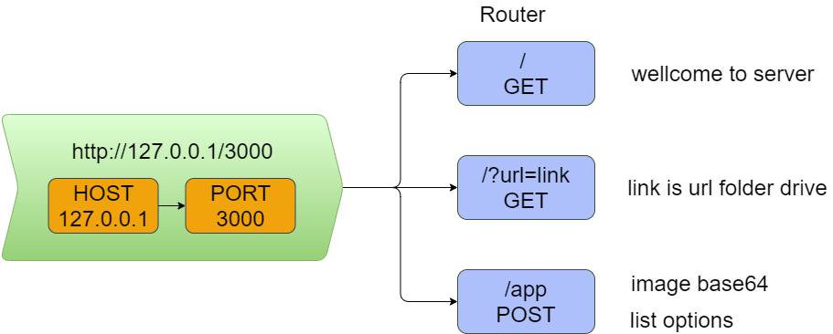
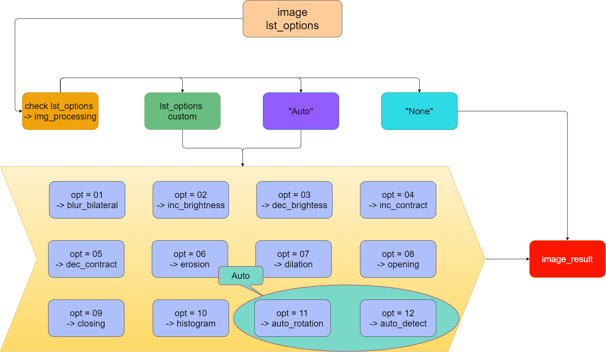
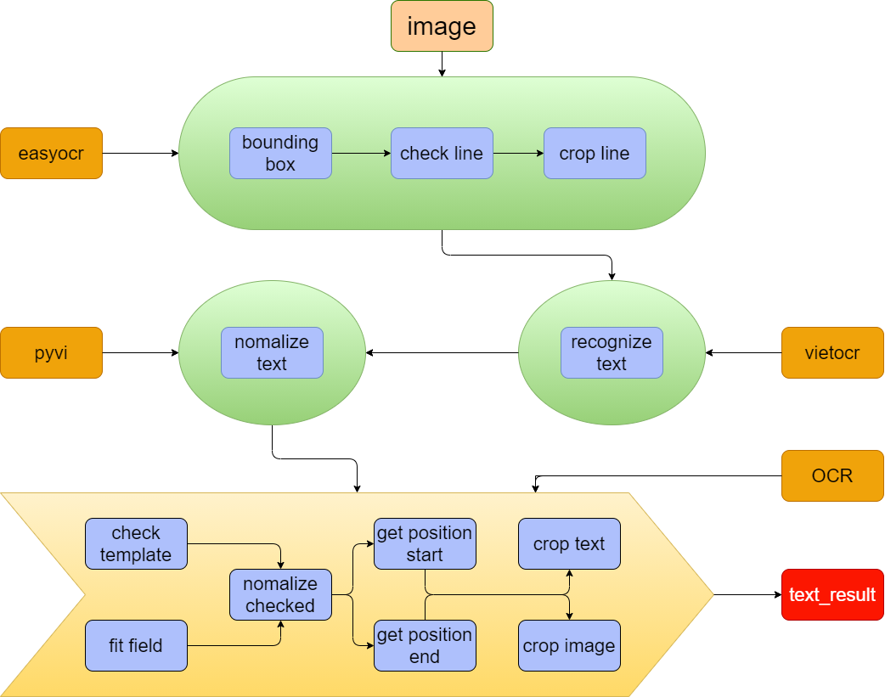

# CS406 - Xử lý ảnh và ứng dụng

```https://github.com/PhamTruongUit/IDCard_OCR
git clone https://github.com/PhamTruongUit/IDCard_OCR
```

### Thành viên nhóm:

| Tên                    | MSSV     |
| ----------------------- | -------- |
| Trần Hoàng Sơn       | 18521351 |
| Nguyễn Trường Thịnh | 18521447 |
| Nguyễn Văn Thịnh     | 18521448 |
| Phạm Ngọc Trường    | 18521571 |

# Base line

## API



## Image processing



## OCR processing



### Contact me with [Facebook](https://www.facebook.com/phamtruonguit/)
